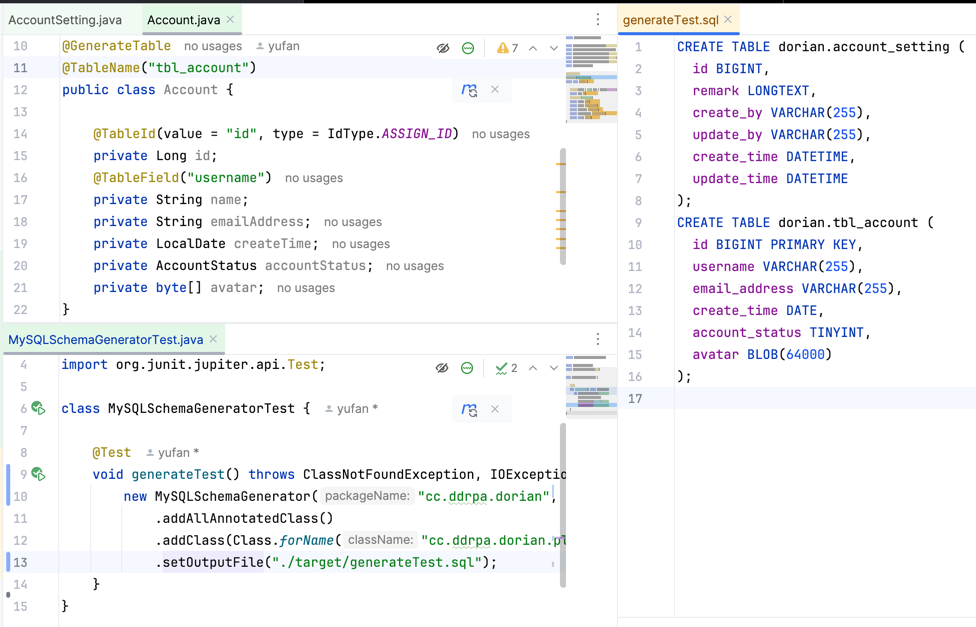

# Elias turns Java POJOs into MySQL Schemas

Elias 可以把 Java POJOs 转换成 MySQL Schema。

笔者平常参与的 Java 项目使用 Mybatis-plus 作为 ORM 层。通常的工作路径是先创建数据库 schema，然后用 Mybatis-plus 的代码生成器生成 Java POJOs 和相关的 DAO 层对象。

可能是受了 JPA 影响，偏好「充血模型」的缘故，笔者不太喜欢这个工作流程：

1. 笔者习惯先编写 MVP 证实业务思路是可行的，这个时候持久层往往还在 H2 上，之后会迁移到 MySQL 或 Postgres，有的时候随着架构设计的演进，还会发生迁移到 NoSQL 上的情况；
2. 在开发早期阶段，互动最为频繁，改动最多的是 Java POJOs（和相应的 DTOs、VOs），笔者也会把一些简单的验证逻辑写在 POJOs 中，从 schema 重新生成代码就会导致一切重新来过；
3. 我们只在 RC+ 的版本中使用 Liquibase 控制 schema 的变更，团队成员如果合作一个模块，在没有协调好的情况下只有 Git 控制的 Java 代码能够拯救他们；
4. 笔者有时候会忘了应该在 MySQL 中使用什么类型<del>（最真实的理由）</del>；

所以笔者编写了这个小工具，可以将指定的 Java 类转换为 MySQL 建表语句。当然，这样的工作流程也会有些缺点，比如你只能靠 diff 工具手动比较后编写 Liquibase 的变更文件了。

# HowTo

项目仍在开发中，API 可以预期地会有调整，你可以查看单元测试中的实体类设计和生成代码了解目前的用法。

项目可以通过 Maven SNAPSHOT 仓库访问。

```xml
  <repositories>
      <repository>
          <id>snapshots</id>
          <url>https://s01.oss.sonatype.org/content/repositories/snapshots/</url>
      </repository>
  </repositories>
```

```sql
drop table if exists `tbl_account`;
create table `tbl_account` (
  `id` int not null auto_increment
      primary key,
  `username` varchar(255) null,
  `email_address` varchar(255) null,
  `create_time` varchar(500) null,
  `account_status` tinyint null,
  `avatar` varchar(255) null
);
create unique index idx_unique_email_address on `tbl_account` (email_address);
create index idx_username on `tbl_account` (username);
create unique index idx_unique_username_email_address on `tbl_account` (username, email_address);
```



# 功能清单与 Roadmap

- [x] 支持 JPA 风格的索引声明
- [x] 支持手动覆盖 SQL 类型声明
- [x] 支持 com.baomidou.mybatisplus.annotation.TableId 声明
- 更多列的控制选项
  - [ ] 支持 Jakarta Persistence API 注解
  - [ ] 支持 com.baomidou.mybatisplus.annotation.TableField 注解中的 JDBC 类型声明
- [x] 输出美化
